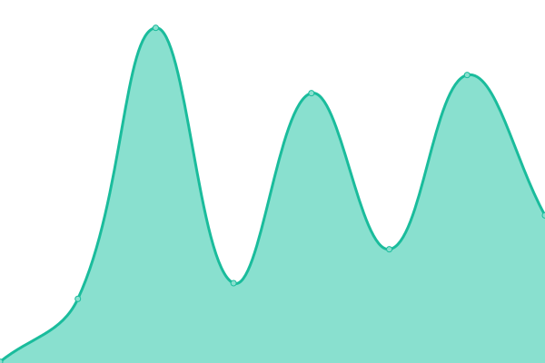

# [📈 Live Status](https://status.osu.in.th): <!--live status--> **🟥 Complete outage**

This repository contains the open-source uptime monitor and status page for [osu.in.th](https://osu.in.th), powered by [Upptime](https://github.com/upptime/upptime).

With [Upptime](https://upptime.js.org), you can get your own unlimited and free uptime monitor and status page, powered entirely by a GitHub repository. We use [Issues](https://github.com/osu-in-th/status/issues) as incident reports, [Actions](https://github.com/osu-in-th/status/actions) as uptime monitors, and [Pages](https://status.osu.in.th) for the status page.

<!--start: status pages-->
<!-- This summary is generated by Upptime (https://github.com/upptime/upptime) -->
<!-- Do not edit this manually, your changes will be overwritten -->
<!-- prettier-ignore -->
| URL | Status | History | Response Time | Uptime |
| --- | ------ | ------- | ------------- | ------ |
|  [Website](https://osu.in.th) | 🟥 Down | [website.yml](https://github.com/osu-in-th/status/commits/HEAD/history/website.yml) | 

 371ms
     
 | 

<a href="https://status.osu.in.th/history/website">100.00%</a>
    

|  [Website (Thai domain)](https://โอสุ.ไทย) | 🟥 Down | [website-thai-domain.yml](https://github.com/osu-in-th/status/commits/HEAD/history/website-thai-domain.yml) | 

 153ms
     
 | 

<a href="https://status.osu.in.th/history/website-thai-domain">100.00%</a>
    

|  [CDN](https://static.osu.in.th/index.html) | 🟥 Down | [cdn.yml](https://github.com/osu-in-th/status/commits/HEAD/history/cdn.yml) | 

 380ms
     
 | 

<a href="https://status.osu.in.th/history/cdn">100.00%</a>
    

|  [Mirror](https://mirror.osu.in.th) | 🟥 Down | [mirror.yml](https://github.com/osu-in-th/status/commits/HEAD/history/mirror.yml) | 

 331ms
     
 | 

<a href="https://status.osu.in.th/history/mirror">100.00%</a>
    

|  [Stream](https://stream.osu.in.th) | 🟥 Down | [stream.yml](https://github.com/osu-in-th/status/commits/HEAD/history/stream.yml) | 

 305ms
     
 | 

<a href="https://status.osu.in.th/history/stream">100.00%</a>
    

|  [UpLink](https://uplink.osu.in.th) | 🟥 Down | [up-link.yml](https://github.com/osu-in-th/status/commits/HEAD/history/up-link.yml) | 

 258ms
     
 | 

<a href="https://status.osu.in.th/history/up-link">100.00%</a>
    

|  [Redis](https://ping.ponlponl123.com/redis) | 🟥 Down | [redis.yml](https://github.com/osu-in-th/status/commits/HEAD/history/redis.yml) | 

 5147ms
     
 | 

<a href="https://status.osu.in.th/history/redis">100.00%</a>
    

<!--end: status pages-->

[**Visit our status website →**](https://status.osu.in.th)

## 📄 License

- Powered by: [Upptime](https://github.com/upptime/upptime)
- Code: [MIT](./LICENSE) © [Anand Chowdhary](https://anandchowdhary.com), supported by [Pabio](https://pabio.com)
- Data in the `./history` directory: [Open Database License](https://opendatacommons.org/licenses/odbl/1-0/)
